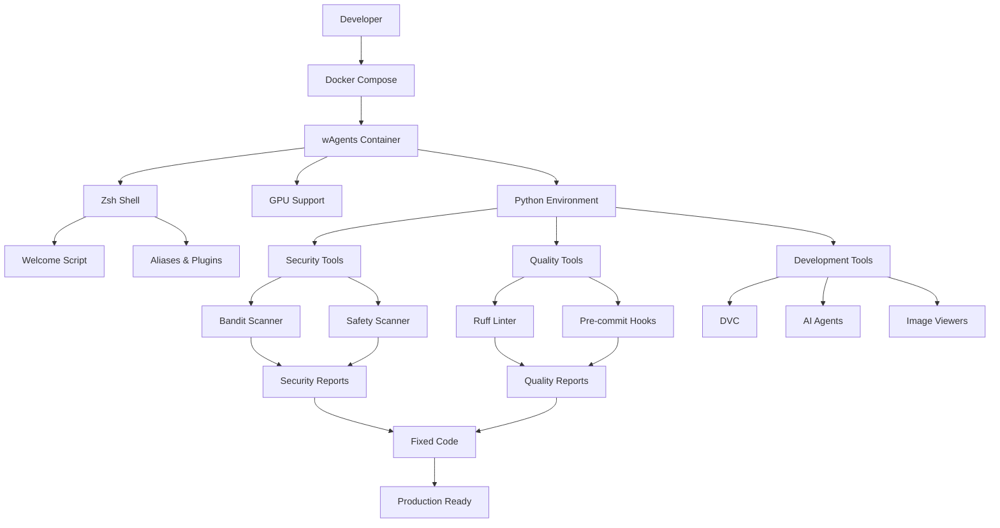
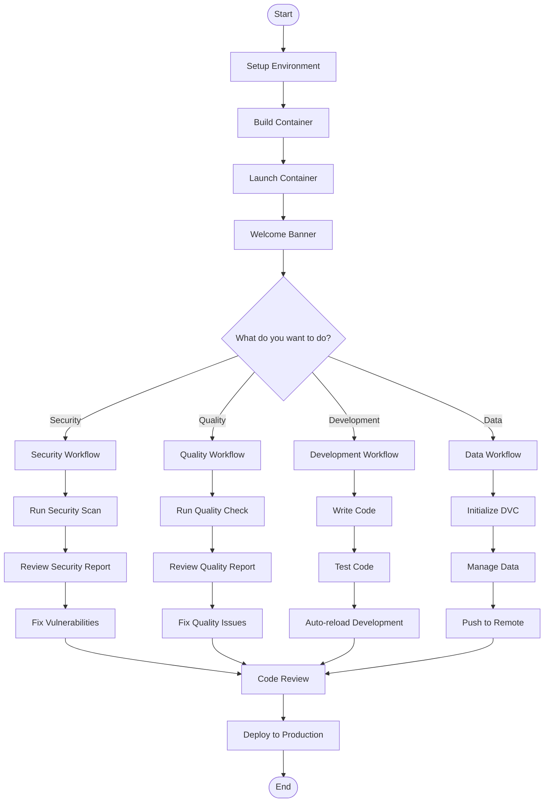

# wAgents - AI Agent Development Environment


A comprehensive Docker-based development environment specifically designed for AI agent development, equipped with GPU acceleration, security tools, code quality assurance, and a rich set of development utilities.

## 🎯 Project Overview

**wAgents** is a production-ready containerized environment that provides everything needed for modern AI agent development. Built on NVIDIA CUDA with GPU support, it includes pre-configured security scanning, code quality tools, data version control, and a sophisticated terminal experience with Zsh and numerous productivity tools.

### Key Features

- **🎯 GPU Acceleration**: Full NVIDIA CUDA 12.0 support for ML/AI workloads
- **🔒 Security-First**: Integrated vulnerability scanning (Bandit, Safety) and security analysis tools
- **✨ Code Quality**: Automated linting, formatting, and pre-commit hooks with Ruff
- **📊 Data Management**: DVC (Data Version Control) with S3 integration
- **🛠️ Development Tools**: Rich terminal experience with Zsh, Oh My Zsh, and 20+ productivity tools
- **🐳 Container Ready**: Optimized Docker setup with GPU passthrough and Docker-in-Docker
- **🤖 AI Agent Support**: Pre-configured for GitHub Copilot and Google Gemini CLI

## 📁 Project Structure

```
wAgents/
├── 📁 python/examples/                    # Example code for testing tools
│   ├── 📁 security/                       # Security vulnerability examples
│   │   ├── 📄 test_code_scan.py          # Code with security vulnerabilities
│   │   └── 📄 test_library_scan.py       # Dependencies with known CVEs
│   ├── 📁 quality/                        # Code quality issue examples
│   │   └── 📄 test_quality_check.py       # Code with quality issues
│   └── 📁 other/                          # General development examples
│       └── 📄 test_other_tools.py         # Code with style issues
├── 📁 requirements/                        # Python dependencies
│   ├── 📄 base.txt                        # Core development tools
│   ├── 📄 dvc.txt                         # Data version control
│   ├── 📄 security.txt                    # Security scanning tools
│   └── 📄 see_image_terminal.txt          # Terminal image viewing
├── 📁 scripts/                             # Automation scripts
│   ├── 📁 executor/                       # Runtime execution scripts
│   │   ├── 📁 security/                  # Security scanning scripts
│   │   │   ├── 📄 scan_code_vulnerability.sh
│   │   │   └── 📄 scan_libraries_vulnerability.sh
│   │   ├── 📁 quality/                   # Code quality scripts
│   │   │   └── 📄 correct_quality_py.sh
│   │   ├── 📁 images/                    # Image viewing scripts
│   │   │   ├── 📄 see_image_with_clickimage.py
│   │   │   └── 📄 see_imagen_with_sixel.py
│   │   ├── 📁 other/                     # Utility scripts
│   │   │   └── 📄 new_curl.sh
│   │   └── 📄 auto_reload_py.sh          # Auto-reload Python apps
│   └── 📁 install/                        # Installation and setup scripts
│       ├── 📄 dvc_controller.sh           # DVC setup
│       ├── 📄 images_control.sh           # Image management
│       └── 📄 other_agents.sh             # AI agents installation
├── 📄 Dockerfile                          # Container definition
├── 📄 docker-compose.yml                  # Service orchestration
├── 📄 README.md                           # This documentation
└── 📄 William-1.jpg                       # Sample image
```

## 🔄 System Workflow



## 🚶‍♂️ Diagram Walkthrough



## 🏗️ Architecture Components

### 1. Container Foundation

**Dockerfile**: Multi-stage build with:
- NVIDIA CUDA 12.0 base image
- Ubuntu 22.04 LTS
- Python 3.x with optimizations
- Zsh shell with Oh My Zsh
- 20+ development tools

**docker-compose.yml**: Service orchestration with:
- GPU passthrough configuration
- Volume mounts for development
- Docker-in-Docker support

### 2. Python Environment

#### Core Dependencies (`requirements/base.txt`)
```
nvitop          # GPU process monitoring
watchdog        # File system monitoring  
ipython         # Enhanced Python REPL
ruff            # Fast Python linter and formatter
pre-commit      # Git hooks management
```

#### Security Tools (`requirements/security.txt`)
```
bandit          # Python security linter
safety          # Dependency vulnerability scanner
httpie          # Modern HTTP client
visidata        # Data analysis tool
scapy           # Packet manipulation
glances         # System monitoring
py-spy          # Python profiler
```

#### Data Management (`requirements/dvc.txt`)
```
pandas          # Data manipulation
dvc             # Data version control
boto3           # AWS SDK for Python
tqdm            # Progress bars
```

### 3. Script Categories

#### Security Scripts (`scripts/executor/security/`)
- **scan_code_vulnerability.sh**: `bandit -r .` - Scan Python code for security issues
- **scan_libraries_vulnerability.sh**: `safety check` - Check dependencies for CVEs

#### Quality Scripts (`scripts/executor/quality/`)
- **correct_quality_py.sh**: `ruff check --fix .` - Auto-fix code quality issues

#### Development Scripts (`scripts/executor/`)
- **auto_reload_py.sh**: `watchmedo auto-restart` - Auto-reload Python apps
- **new_curl.sh**: Enhanced curl wrapper

#### Installation Scripts (`scripts/install/`)
- **dvc_controller.sh**: Install DVC with S3 support
- **images_control.sh**: Manage Python environments
- **other_agents.sh**: Install AI agents (Copilot, Gemini)

## 📚 Usage Examples

### Quick Start

1. **Build and run the container**
   ```bash
   docker-compose up --build -d
   ```

2. **Access the container**
   ```bash
   docker-compose exec agent zsh
   ```

3. **View available tools**
   ```bash
   help  # Shows welcome banner
   ```

### Security Testing

```bash
# Test security scanning on vulnerable code
cd python/examples/security
../../../scripts/executor/security/scan_code_vulnerability.sh

# Expected output: Security vulnerabilities found in test_code_scan.py
# - SQL injection in vulnerable_function()
# - Dangerous eval() usage
# - Hardcoded passwords
# - Path traversal issues

# Test dependency scanning
../../../scripts/executor/security/scan_libraries_vulnerability.sh

# Expected output: Vulnerabilities found in test_library_scan.py
# - Outdated packages with known CVEs
```

### Code Quality Testing

```bash
# Test quality checking on problematic code
cd python/examples/quality
../../../scripts/executor/quality/correct_quality_py.sh

# Expected output: Quality issues found and fixed in test_quality_check.py
# - Line length violations
# - Unused variables
# - Import organization
# - Code formatting issues
```

### Development Workflow

```bash
# Auto-reload development server
cd /app
./scripts/executor/auto_reload_py.sh

# View images in terminal
./scripts/executor/images/see_imagen_with_sixel.py scripts/William-1.jpg

# Use productivity aliases
ls          # Enhanced listing with icons
ll          # Detailed listing
cd myproject # Smart directory jumping
grep "pattern" . # Fast search with ripgrep
```

## 📋 File-by-File Guide

### Configuration Files

| File | Purpose | Key Settings |
|------|---------|--------------|
| `Dockerfile` | Container definition | CUDA 12.0, Zsh, GPU tools |
| `docker-compose.yml` | Service orchestration | GPU passthrough, volumes |
| `requirements/base.txt` | Core Python packages | Development essentials |
| `requirements/security.txt` | Security tools | Bandit, Safety, Scapy |
| `requirements/dvc.txt` | Data management | DVC, Pandas, Boto3 |

### Script Files

| Category | Script | Function | Usage |
|----------|--------|----------|-------|
| Security | `scan_code_vulnerability.sh` | Bandit security scan | `./scripts/executor/security/scan_code_vulnerability.sh` |
| Security | `scan_libraries_vulnerability.sh` | Safety dependency scan | `./scripts/executor/security/scan_libraries_vulnerability.sh` |
| Quality | `correct_quality_py.sh` | Ruff quality check | `./scripts/executor/quality/correct_quality_py.sh` |
| Development | `auto_reload_py.sh` | Auto-reload Python | `./scripts/executor/auto_reload_py.sh` |
| Install | `dvc_controller.sh` | DVC setup | `./scripts/install/dvc_controller.sh` |
| Install | `other_agents.sh` | AI agents install | `./scripts/install/other_agents.sh` |

### Example Files

| File | Purpose | Issues Demonstrated |
|------|---------|-------------------|
| `python/examples/security/test_code_scan.py` | Security vulnerabilities | SQL injection, eval(), hardcoded passwords |
| `python/examples/security/test_library_scan.py` | Dependency vulnerabilities | Outdated packages with CVEs |
| `python/examples/quality/test_quality_check.py` | Code quality issues | Long lines, unused variables, formatting |
| `python/examples/other/test_other_tools.py` | Style issues | Trailing whitespace, mixed tabs/spaces |

## 🔧 Customization Guide

### Adding New Security Tools

1. **Add to requirements/security.txt**
   ```txt
   new-security-tool==1.0.0
   ```

2. **Create script in scripts/executor/security/**
   ```bash
   #!/bin/bash
   new-security-tool scan .
   ```

3. **Add example in python/examples/security/**
   ```python
   # Code with vulnerabilities for new tool to detect
   ```

### Adding New Quality Tools

1. **Add to requirements/base.txt**
   ```txt
   new-quality-tool==1.0.0
   ```

2. **Create script in scripts/executor/quality/**
   ```bash
   #!/bin/bash
   new-quality-tool check --fix .
   ```

3. **Add example in python/examples/quality/**
   ```python
   # Code with quality issues for new tool to detect
   ```

### Custom Aliases

Add to `Dockerfile` in the ZSH configuration section:
```dockerfile
RUN echo "alias mycommand='my-actual-command'" >> ~/.zshrc
```

## 🚀 Deployment

### Production Deployment

```bash
# Build production image
docker build -t wisrovi/agents:gpu-slim .

# Run with GPU support
docker run --gpus all -v $(pwd):/app wisrovi/agents:gpu-slim
```

### CI/CD Integration

```yaml
# .github/workflows/quality.yml
name: Quality and Security Checks
on: [push, pull_request]

jobs:
  checks:
    runs-on: ubuntu-latest
    container: wisrovi/agents:gpu-slim
    steps:
      - uses: actions/checkout@v3
      - name: Security Scan
        run: ./scripts/executor/security/scan_code_vulnerability.sh
      - name: Quality Check
        run: ./scripts/executor/quality/correct_quality_py.sh
```

## 🤝 Contributing

1. **Fork the repository**
2. **Create feature branch**: `git checkout -b feature/amazing-feature`
3. **Make changes and test**:
   ```bash
   ./scripts/executor/security/scan_code_vulnerability.sh
   ./scripts/executor/quality/correct_quality_py.sh
   ```
4. **Commit changes**: `git commit -m 'Add amazing feature'`
5. **Push and create PR**

## 📞 Support

- 📧 Email: wisrovi.rodriguez@gmail.com
- 💼 LinkedIn: [wisrovi-rodriguez](https://es.linkedin.com/in/wisrovi-rodriguez)
- 🐛 Issues: [GitHub Issues](https://github.com/wisrovi/wAgents/issues)

---

**Built with ❤️ for the AI Agent development community**