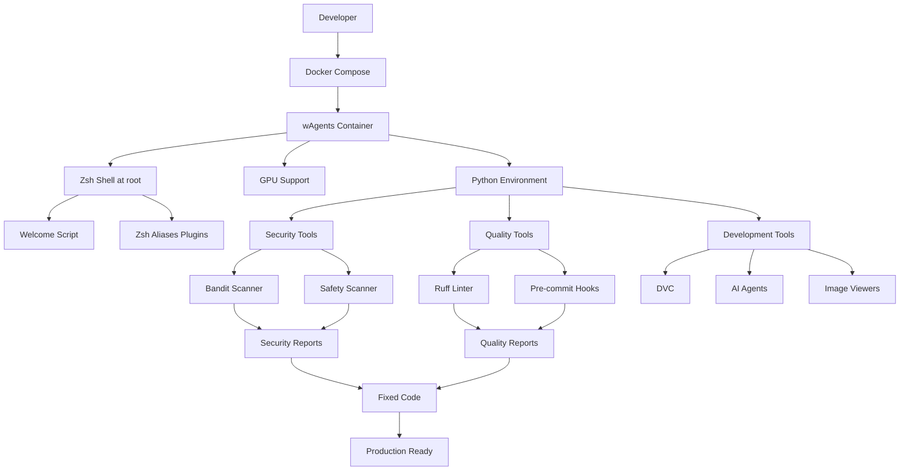
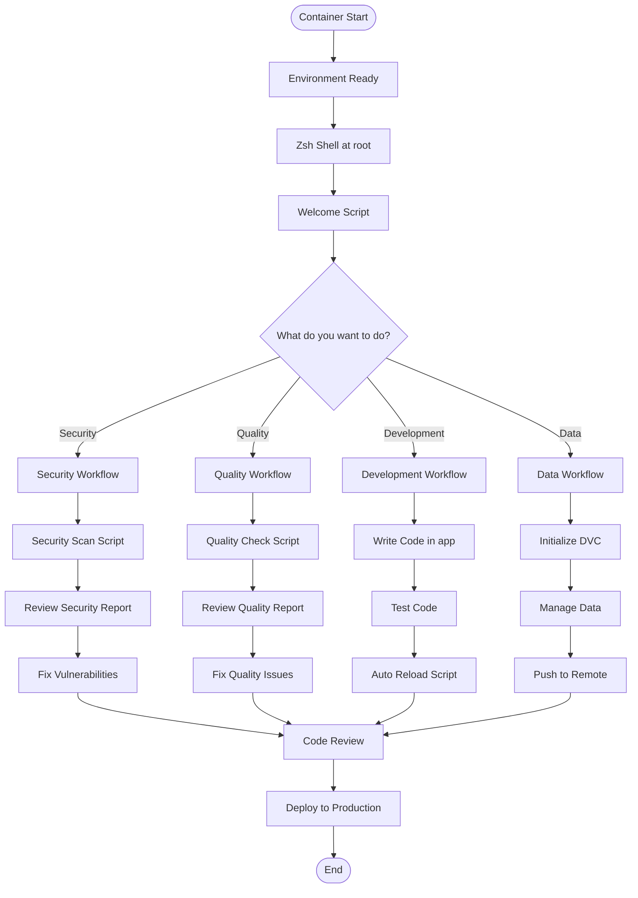
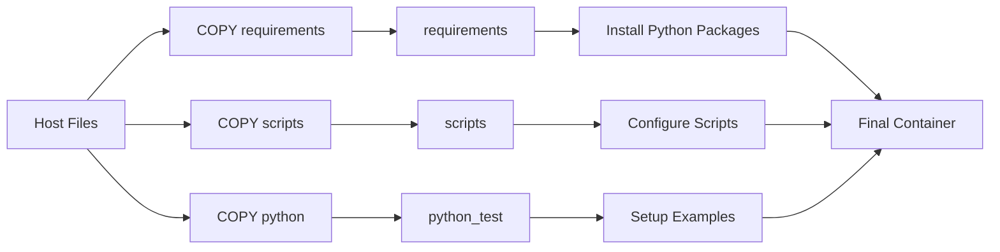
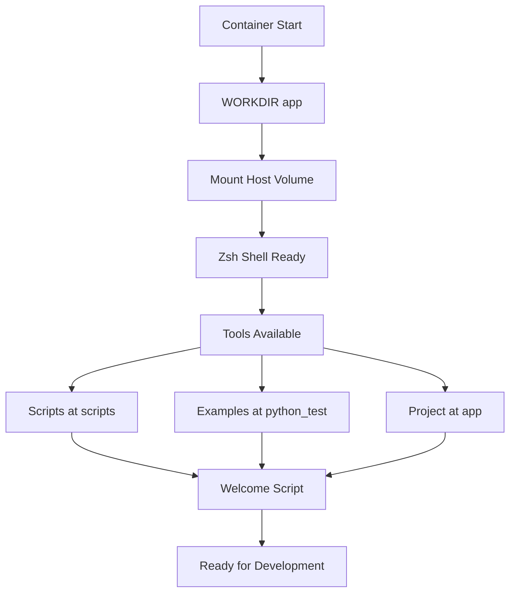

# wAgents - Docker Container Guide


A comprehensive Docker-based development environment specifically designed for AI agent development, equipped with GPU acceleration, security tools, code quality assurance, and a rich set of development utilities.

## 🎯 What's Inside This Container

Once you build and run this container, you get a **complete AI development environment** with:

- **🎯 GPU Acceleration**: Full NVIDIA CUDA 12.0 support for ML/AI workloads
- **🔒 Security-First**: Integrated vulnerability scanning (Bandit, Safety) and security analysis tools
- **✨ Code Quality**: Automated linting, formatting, and pre-commit hooks with Ruff
- **📊 Data Management**: DVC (Data Version Control) with S3 integration
- **🛠️ Development Tools**: Rich terminal experience with Zsh, Oh My Zsh, and 20+ productivity tools
- **🐳 Container Ready**: Optimized Docker setup with GPU passthrough and Docker-in-Docker
- **🤖 AI Agent Support**: Pre-configured for GitHub Copilot and Google Gemini CLI

## 📁 Container File Structure

```
Container: wAgents/
├── 📁 /app/                              # Main application directory (mounted from host)
│   ├── 📁 python/examples/               # Example code for testing tools
│   │   ├── 📁 security/                  # Security vulnerability examples
│   │   │   ├── 📄 test_code_scan.py     # Code with security vulnerabilities
│   │   │   └── 📄 test_library_scan.py  # Dependencies with known CVEs
│   │   ├── 📁 quality/                   # Code quality issue examples
│   │   │   └── 📄 test_quality_check.py # Code with quality issues
│   │   └── 📁 other/                     # General development examples
│   │       └── 📄 test_other_tools.py    # Code with style issues
│   ├── 📁 requirements/                  # Python dependencies
│   │   ├── 📄 base.txt                   # Core development tools
│   │   ├── 📄 dvc.txt                    # Data version control
│   │   ├── 📄 security.txt               # Security scanning tools
│   │   └── 📄 see_image_terminal.txt     # Terminal image viewing
│   ├── 📁 scripts/                       # Automation scripts
│   │   ├── 📁 executor/                  # Runtime execution scripts
│   │   │   ├── 📁 security/             # Security scanning scripts
│   │   │   │   ├── 📄 scan_code_vulnerability.sh
│   │   │   │   └── 📄 scan_libraries_vulnerability.sh
│   │   │   ├── 📁 quality/              # Code quality scripts
│   │   │   │   └── 📄 correct_quality_py.sh
│   │   │   ├── 📁 images/               # Image viewing scripts
│   │   │   │   ├── 📄 see_image_with_clickimage.py
│   │   │   │   └── 📄 see_imagen_with_sixel.py
│   │   │   ├── 📁 other/                # Utility scripts
│   │   │   │   └── 📄 new_curl.sh
│   │   │   └── 📄 auto_reload_py.sh     # Auto-reload Python apps
│   │   └── 📁 install/                  # Installation and setup scripts
│   │       ├── 📄 dvc_controller.sh     # DVC setup
│   │       ├── 📄 images_control.sh     # Image management
│   │       └── 📄 other_agents.sh       # AI agents installation
│   ├── 📄 Dockerfile                    # Container definition
│   ├── 📄 docker-compose.yml            # Service orchestration
│   ├── 📄 README.md                     # Host documentation
│   └── 📄 William-1.jpg                 # Sample image
├── 📁 /requirements/                     # Container requirements (build-time copy)
├── 📁 /scripts/                          # Container scripts (build-time copy)
├── 📁 /python_test/                      # Test Python files (build-time copy)
└── 📁 /root/                             # Home directory with Zsh config
```

## 🔄 System Architecture



## 🏗️ Complete Architecture Overview

```mermaid
graph TB
    subgraph "One Command Deployment"
        A["docker-compose up --build"]
    end
    
    subgraph "Instant Environment Ready"
        B["wAgents Container<br/>GPU + CUDA 12.0"]
    end
    
    subgraph "Complete Tool Suite Pre-Installed"
        C[Security Stack]
        D[Quality Stack]
        E[Development Stack]
        F[Productivity Stack]
    end
    
    subgraph "Security Tools"
        C1[Bandit<br/>Security Linter]
        C2[Safety<br/>Dependency Scanner]
        C3[Scapy<br/>Packet Analysis]
        C4[Py-spy<br/>Profiler]
    end
    
    subgraph "Quality Tools"
        D1[Ruff<br/>Linter & Formatter]
        D2[Pre-commit<br/>Git Hooks]
        D3[Black<br/>Code Formatter]
        D4[isort<br/>Import Sorter]
    end
    
    subgraph "Development Tools"
        E1[DVC<br/>Data Version Control]
        E2[Pandas<br/>Data Manipulation]
        E3[Boto3<br/>AWS SDK]
        E4[IPython<br/>Enhanced REPL]
        E5[Nvitop<br/>GPU Monitor]
    end
    
    subgraph "Productivity Tools"
        F1[Zsh Oh My Zsh<br/>Enhanced Shell]
        F2[Exa Ripgrep Fd<br/>Modern Unix Tools]
        F3[Btop Procs<br/>System Monitoring]
        F4[Broot Zoxide<br/>Smart Navigation]
        F5[Lazydocker<br/>Docker Management]
    end
    
    subgraph "Time Savings vs Manual Setup"
        G["2 Hours Saved<br/>No Installation Required"]
        H["Zero Configuration<br/>Everything Just Works"]
        I["Production Ready<br/>Best Practices Included"]
    end
    
    subgraph "What You Get Instantly"
        J["Secure Code<br/>Automated Scanning"]
        K["Clean Code<br/>Auto-formatting"]
        L["GPU Acceleration<br/>ML AI Ready"]
        M["Data Management<br/>Version Control"]
        N["Professional Workflow<br/>Industry Standards"]
    end
    
    A --> B
    B --> C
    B --> D
    B --> E
    B --> F
    
    C --> C1
    C --> C2
    C --> C3
    C --> C4
    
    D --> D1
    D --> D2
    D --> D3
    D --> D4
    
    E --> E1
    E --> E2
    E --> E3
    E --> E4
    E --> E5
    
    F --> F1
    F --> F2
    F --> F3
    F --> F4
    F --> F5
    
    B --> G
    B --> H
    B --> I
    
    G --> J
    H --> K
    I --> L
    I --> M
    I --> N
```



## 🚶‍♂️ Container Workflow



## 🏗️ Container Environment

### 1. Shell Environment

When you enter the container, you get:

```bash
# You are here: /root (home directory)
# Shell: Zsh with Oh My Zsh
# Prompt: Customized with git status
# Aliases: 20+ productivity shortcuts
```

**Key Aliases Available:**
```bash
# Navigation
ls          # Enhanced listing with icons (exa)
ll          # Detailed listing (exa -l --icons)
la          # All files with details (exa -la --icons)
cd myproject # Smart directory jumping (zoxide)
tree        # Interactive directory tree (broot)

# Search & Find
grep pattern . # Fast search with ripgrep
find filename   # Fast file finding (fd)

# System Monitoring
du          # Better disk usage (dust)
df          # Better disk free (duf)
ps          # Better process listing (procs)
top         # Better system monitor (btop)

# Development
cat file    # Cat with syntax highlighting (batcat)
nano file   # Microsoft Edit editor
help        # Shows welcome banner
```

### 2. Python Environment

All Python tools are pre-installed and ready:

```bash
# Security tools
bandit --version          # Security linter
safety --version          # Dependency scanner
scapy                     # Packet manipulation

# Quality tools  
ruff --version            # Fast linter/formatter
pre-commit --version      # Git hooks

# Data tools
dvc --version             # Data version control
pandas --version          # Data manipulation
boto3 --version           # AWS SDK

# Development tools
ipython                   # Enhanced Python REPL
nvitop                    # GPU process monitoring
watchdog                  # File system monitoring
```

### 3. Container Paths (Based on Dockerfile COPY locations)

| Container Path | Purpose | What You'll Find |
|----------------|---------|------------------|
| `/app` | Main application directory | Your project files (mounted from host) |
| `/scripts` | Build-time scripts copy | Scripts copied during build |
| `/scripts/executor/security/` | Security tools | Vulnerability scanning scripts |
| `/scripts/executor/quality/` | Quality tools | Code quality scripts |
| `/python_test` | Test Python files copy | Python examples copied during build |
| `/python_test/examples/` | Test examples | Code with intentional issues |
| `/requirements` | Requirements copy | Requirements files copied during build |
| `/root/.zshrc` | Shell configuration | Aliases, plugins, settings |
| `/root/.oh-my-zsh/` | Zsh framework | Plugins and themes |

## 📚 Getting Started Inside Container

### First Steps

```bash
# 1. Enter the container
docker-compose exec agent zsh

# 2. You'll see the welcome banner automatically
# 3. Navigate to your project
cd /app

# 4. See what's available
help  # Shows all tools and scripts
ls    # See project structure
```

### Security Testing

```bash
# Navigate to security examples (using build-time copy)
cd /python_test/examples/security

# Run security scan on vulnerable code
/scripts/executor/security/scan_code_vulnerability.sh

# Expected output:
# >> Issue: [B608:hardcoded_sql_expressions] 
# >> Severity: Medium   Confidence: High
# >> Location: test_code_scan.py:6
# >> More Info: https://bandit.readthedocs.io/en/latest/

# Run dependency vulnerability scan
/scripts/executor/security/scan_libraries_vulnerability.sh

# Expected output:
# >> WARNING: requests==2.25.0 has known vulnerabilities
# >> WARNING: urllib3==1.26.0 has known vulnerabilities
```

### Code Quality Testing

```bash
# Navigate to quality examples (using build-time copy)
cd /python_test/examples/quality

# Run quality check and auto-fix
/scripts/executor/quality/correct_quality_py.sh

# Expected output:
# >> test_quality_check.py:6:1: E501 Line too long (85 > 88)
# >> test_quality_check.py:9:1: F841 Unused variable 'unused_var'
# >> Fixed 2 issues
```

### Development Workflow

```bash
# Navigate to your project
cd /app

# Start auto-reload development server
/scripts/executor/auto_reload_py.sh

# In another terminal, view images
/scripts/executor/images/see_imagen_with_sixel.py /app/scripts/William-1.jpg

# Use productivity tools
rg "import" /python_test/examples/  # Fast search
exa --tree /python_test/examples/  # Tree view
btop                               # System monitor
```

## 🔧 Available Tools by Category

### Security Tools

| Tool | Command | Purpose | Example Usage |
|------|---------|---------|---------------|
| **Bandit** | `bandit -r .` | Python security linter | `bandit -r /python_test/examples/` |
| **Safety** | `safety check` | Dependency vulnerability scanner | `safety check -r requirements.txt` |
| **Scapy** | `python -c "import scapy"` | Packet manipulation | `scapy.all.IP().show()` |
| **Py-spy** | `py-spy top --pid <pid>` | Python profiler | `py-spy top -- python app.py` |

### Quality Tools

| Tool | Command | Purpose | Example Usage |
|------|---------|---------|---------------|
| **Ruff** | `ruff check --fix .` | Fast linter/formatter | `ruff check --fix /python_test/examples/` |
| **Pre-commit** | `pre-commit run --all-files` | Git hooks | `pre-commit run --all-files` |
| **Black** | `ruff format .` | Code formatter | `ruff format /python_test/examples/` |

### Development Tools

| Tool | Command | Purpose | Example Usage |
|------|---------|---------|---------------|
| **DVC** | `dvc init` | Data version control | `dvc init --no-scm` |
| **IPython** | `ipython` | Enhanced REPL | `ipython --matplotlib` |
| **NVitop** | `nvitop` | GPU monitoring | `nvitop` |
| **Watchdog** | `watchmedo` | File monitoring | `watchmedo auto-restart .` |

### Productivity Tools

| Tool | Alias | Purpose | Example Usage |
|------|-------|---------|---------------|
| **Exa** | `ls`, `ll`, `la` | Modern ls | `ll --git` |
| **Ripgrep** | `grep` | Fast search | `grep "TODO" /python_test/` |
| **Fd** | `find` | Fast find | `find "*.py" /python_test/` |
| **Broot** | `tree` | Interactive tree | `tree /python_test/` |
| **Dust** | `du` | Disk usage | `du /python_test/` |
| **Duf** | `df` | Disk free | `df -h` |
| **Procs** | `ps` | Process list | `ps python` |
| **Btop** | `top` | System monitor | `btop` |

## 🔄 Container Lifecycle

### Build Process



### Runtime Process



## 🐛 Container Troubleshooting

### Common Issues & Solutions

#### GPU Not Available
```bash
# Check GPU inside container
nvidia-smi

# Expected output: GPU information table
# If error: Check NVIDIA runtime installation
docker run --rm --gpus all wisrovi/agents:gpu-slim nvidia-smi
```

#### Scripts Not Executable
```bash
# Fix permissions inside container
chmod +x /scripts/executor/security/*.sh
chmod +x /scripts/executor/quality/*.sh
chmod +x /scripts/install/*.sh

# Or run with bash explicitly
bash /scripts/executor/security/scan_code_vulnerability.sh
```

#### Python Packages Not Found
```bash
# Check installed packages
pip list | grep -E "(bandit|safety|ruff|dvc)"

# Reinstall if needed
pip install -r /requirements/security.txt
pip install -r /requirements/base.txt
```

#### Aliases Not Working
```bash
# Reload shell configuration
source /root/.zshrc

# Or restart container
docker-compose restart agent
```

### Container Debugging

```bash
# Check container status
docker-compose ps

# Access container with full shell
docker-compose exec agent zsh

# Check environment variables
env | grep -E "(PATH|PYTHON|CUDA|HOME)"

# Check mounted volumes
mount | grep /app

# Check running processes
ps aux | grep -E "(python|zsh)"

# Check disk usage
df -h
du -sh /python_test
```

### Performance Monitoring

```bash
# Monitor GPU usage
nvitop

# Monitor system resources
btop

# Monitor Python processes
py-spy top --pid $(pgrep -f python)

# Check network connectivity
ping google.com
curl -I https://github.com
```

## 🚀 Advanced Usage

### Custom Development Environment

```bash
# Create custom workspace
mkdir -p /app/workspace/my_project
cd /app/workspace/my_project

# Initialize git
git init
git config --global user.name "Your Name"
git config --global user.email "your.email@example.com"

# Set up pre-commit hooks
pre-commit install

# Initialize DVC for data management
dvc init
dvc remote add -d myremote s3://my-bucket/data
```

### Batch Processing

```bash
# Run security scans on all Python files
find /python_test -name "*.py" -exec bandit {} \;

# Run quality checks with output to file
ruff check /python_test/examples/ > quality_report.txt

# Run dependency checks on all requirements
find /requirements -name "*.txt" -exec safety check -r {} \;
```

### Container Customization

```bash
# Add custom aliases (temporary)
echo "alias mytool='python /scripts/mytool.py'" >> /root/.zshrc
source /root/.zshrc

# Install additional Python packages
pip install jupyterlab matplotlib seaborn

# Install system packages
apt-get update && apt-get install -y htop tree
```

## 📞 Support

- 📧 Email: wisrovi.rodriguez@gmail.com
- 💼 LinkedIn: [wisrovi-rodriguez](https://es.linkedin.com/in/wisrovi-rodriguez)
- 🐛 Issues: [GitHub Issues](https://github.com/wisrovi/wAgents/issues)

---

**Built with ❤️ for the AI Agent development community**

*This guide focuses on what you'll find inside the container once it's built and running.*